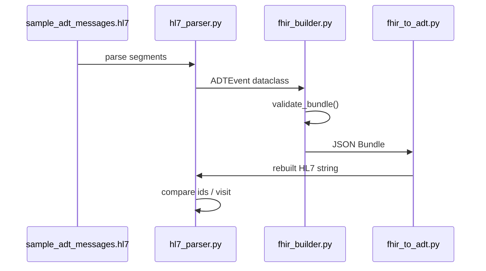
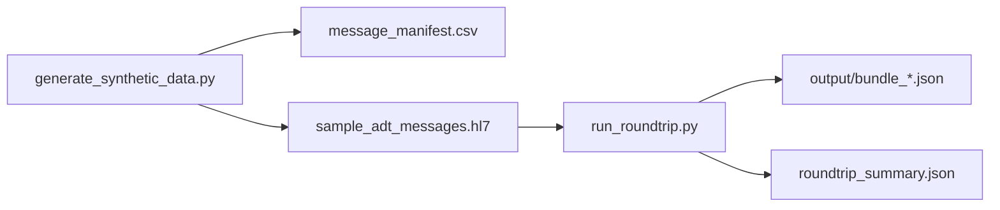

# HL7 v2 / FHIR R4 Interoperability Lab (Synthetic ADT)

**Author:** [Faiz Elahi](https://github.com/faizelahi) · **Type:** EDUCATIONAL LAB · **No PHI, no live interfaces**

---

## Educational disclaimer / synthetic data

This lab parses **synthetic HL7 v2 ADT** messages and builds **FHIR R4 Bundles** (Patient, Encounter, MessageHeader) locally. There is **no MLLP listener**, **no HAPI server**, and **no connection** to hospital interfaces. Patient identifiers and visit numbers are **fabricated** for learning.

Round-trip success on synthetic IDs proves **field mapping for a subset of elements**—not full US Core conformance or vendor certification.

---

## Problem statement (detailed)

Hospitals still exchange **HL7 v2** admit/discharge/transfer (ADT) events through integration engines, while modern apps consume **FHIR R4** resources. Interface engineers must:

1. **Parse** pipe-delimited segments (MSH, PID, PV1),
2. **Map** fields to FHIR resources with correct cardinality,
3. **Validate** bundles before downstream consumption,
4. **Debug** round-trip loss when rebuilding v2 from FHIR.

Reading specification PDFs alone rarely cements **newline handling**, **trigger events** (A01/A03/A08), and **MessageHeader** conventions. This lab generates **500 ADT messages**, runs **`src/run_roundtrip.py`**, saves sample JSON bundles, and summarizes match flags in **`output/roundtrip_summary.json`**.

---

## Why this tool

| Manual copy/paste one message | Pipeline over corpus |
|-------------------------------|----------------------|
| Misses scale bugs | 500-message batch exposes parse edge cases |
| Skips validation step | `validate_bundle` teaches required resources |
| No round-trip | `fhir_to_adt.py` shows mapping asymmetry |

Python modules are small enough to read in one class session—closer to **integration engine transforms** than to a full Mirth channel deploy.

---

## Architecture





See [`docs/architecture.md`](docs/architecture.md).

---

## Dataset dictionary (tables / columns)

### `data/sample_adt_messages.hl7`

| Attribute | Value |
|-----------|--------|
| Count | 500 messages |
| Triggers | ADT^A01, A03, A08 (synthetic mix) |
| Segments | MSH, PID, PV1 (minimal teaching subset) |

### `data/message_manifest.csv`

| Column | Description |
|--------|-------------|
| Index fields | Message order and metadata (see file header after generation) |
| `patient_id` | Synthetic patient identifier for cross-check |
| Trigger / event columns | ADT trigger labeling for charts |

### `output/bundle_001.json` … `bundle_010.json`

Example FHIR **Bundle** JSON with `Patient`, `Encounter`, `MessageHeader` entries.

### `output/roundtrip_summary.json`

| Field (per message) | Description |
|---------------------|-------------|
| `patient_id_match` | Whether round-trip preserved patient id |
| `visit_match` | Whether visit/account identifiers align (teaching subset) |

---

## Prerequisites

- Python 3.10+
- Standard library + project deps in `requirements.txt` (if any pinned)
- No interface engine required

---

## Step-by-step: how to run

### Windows PowerShell

```powershell
cd hl7-fhir-interop-lab
python -m venv .venv
.\.venv\Scripts\Activate.ps1
pip install -r requirements.txt
python scripts/generate_synthetic_data.py
python src/run_roundtrip.py
python scripts/generate_charts.py
```

### Optional bash

```bash
cd hl7-fhir-interop-lab
python3 -m venv .venv && source .venv/bin/activate
pip install -r requirements.txt
python scripts/generate_synthetic_data.py
python src/run_roundtrip.py
python scripts/generate_charts.py
```

---

## File-by-file walkthrough

| Module | Purpose |
|--------|---------|
| `src/hl7_parser.py` | Parse MSH/PID/PV1 into `ADTEvent`; rebuild HL7 text |
| `src/fhir_builder.py` | Build Bundle with Patient, Encounter, MessageHeader; `validate_bundle()` |
| `src/fhir_to_adt.py` | Extract `ADTEvent` from Bundle (educational subset) |
| `src/run_roundtrip.py` | Batch validate; write first 10 bundles + summary JSON |
| `scripts/generate_synthetic_data.py` | Creates HL7 file + manifest |
| `scripts/generate_charts.py` | ADT trigger counts; round-trip match rate charts |

---

## Expected outputs and how to interpret them

| Signal | Healthy teaching run |
|--------|----------------------|
| `validate_bundle` | No errors for each of 500 messages |
| `roundtrip_summary.json` | **`patient_id_match`: true** and **`visit_match`: true** for all rows after parser newline handling |
| Charts | Trigger distribution; match rates at 100% for synthetic mapping scope |
| Bundle JSON | Inspect `resourceType` entries and references |

If matches fail after editing parser, check **line endings** (`\r` vs `\n`) first.

---

## Results interpretation

- **100% match** here means **synthetic subset fields** round-trip—not that Epic or Cerner will accept the same Bundle unchanged.
- **MessageHeader** included for teaching receivers that expect metadata—some systems differ.
- **Gender/date normalization** (HL7 tables vs FHIR codes) is simplified—production needs terminology services.

---

## Glossary (8+ terms)

1. **HL7 v2** — Legacy pipe-delimited clinical messaging standard.
2. **ADT** — Admit, Discharge, Transfer message family.
3. **FHIR R4** — Modern REST-oriented healthcare resource standard (4th major version).
4. **Bundle** — FHIR container holding multiple resources in one payload.
5. **MSH** — Message header segment (sending application, trigger, control id).
6. **PID** — Patient identification segment.
7. **PV1** — Patient visit segment (location, class, visit id).
8. **Round-trip** — v2 → FHIR → v2 rebuild to detect mapping loss.
9. **MLLP** — Minimal Lower Layer Protocol framing for TCP HL7—**not implemented** here.
10. **Trigger event** — e.g., A01 admit, A03 discharge, A08 update.

---

## Common mistakes (5+)

1. Splitting segments on **`\r` only** when files use **`\n`** line endings (Windows editors).
2. Treating **MessageHeader** as optional for all receiving systems.
3. Skipping **gender and date normalization** between HL7 and FHIR formats.
4. Claiming **US Core compliance** from this minimal resource set.
5. Testing **one message** manually while batch corpus fails on edge case #401.
6. Confusing **FHIR JSON pretty-print** with wire format requirements in engines.

---

## Exercises (5+)

1. Map **attending provider** from PV1 to a `Practitioner` resource.
2. Add **OBX** vitals and **`Observation`** resources.
3. Emit **NDJSON** for bulk FHIR import drills.
4. Compare Bundle structure to a published **ADT FHIR implementation guide** (conceptual reading assignment).
5. Add **negative tests** where intentional bad segments fail `validate_bundle`.
6. Wire a subset of encounters into **`caboodle-edw-star-schema-lab`** fact grain discussion (messages vs facts).

---

## Limitations / simulation vs production

| This lab | Production interop |
|----------|-------------------|
| File-based HL7 | MLLP, ACK/NACK, retry queues |
| Subset segments | Full ORU, MDM, scheduling, etc. |
| No HAPI server | Server-side validation profiles |
| Synthetic IDs | Real identifier systems + MPI |
| No signatures | IHE/document trust frameworks |

---

## Related labs

- [`gcp-healthcare-api-concepts-lab`](../gcp-healthcare-api-concepts-lab/) — Cloud FHIR store concepts.
- [`azure-health-data-platform-lab`](../azure-health-data-platform-lab/) — Health data platform patterns.
- [`caboodle-edw-star-schema-lab`](../caboodle-edw-star-schema-lab/) — Warehouse facts downstream of ADT feeds.
- [`dbt-healthcare-marts-lab`](../dbt-healthcare-marts-lab/) — Analytics on claims/members (different feed).

---

**Author:** Faiz Elahi · Synthetic patients only.
